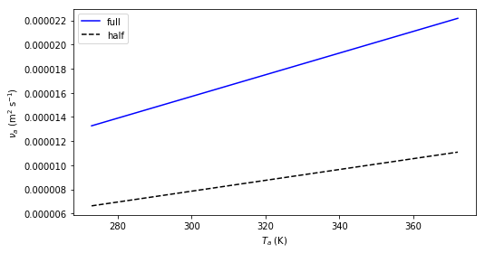
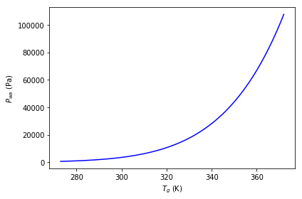
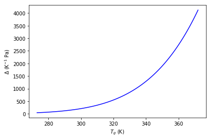
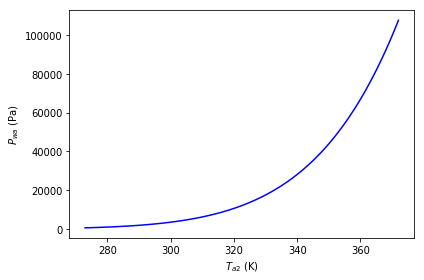

Environmental Science for Symbolic Math 
========================================

(Stan Schymanski and Jiri Kuncar)

This notebook gives examples and common use cases for ESSM. The ESSM
package documentation can be obtained from here:
https://essm.readthedocs.io/en/latest/

The code is openly available here:
https://github.com/environmentalscience/essm

Installation
============

See the documentation for different installation option, but the easiest
is:

::

   pip install essm

General Jupyter setup
=====================

We will first setup the IPython notebook to nicely render the results:

.. code:: ipython3

    import sys
    before = [str(m) for m in sys.modules]  # This is to track what modules have been imported in this notebook

.. code:: ipython3

    from IPython.display import display
    from sympy import init_printing
    init_printing() 
    from sympy.printing import StrPrinter
    StrPrinter._print_Quantity = lambda self, expr: str(expr.abbrev)    # displays short units (m instead of meter)

.. code:: ipython3

    import scipy as sc

Importing variables and equations
=================================

.. code:: ipython3

    # Import various functions from sympy
    from sympy import Derivative, Eq, exp, log, solve, Symbol

.. code:: ipython3

    from essm.variables import Variable
    from essm.variables.utils import generate_metadata_table

.. code:: ipython3

    import essm.variables.chamber.insulation as insulation_vars
    import essm.equations.chamber.insulation as insulation_eqs

.. code:: ipython3

    vars = ['insulation_vars.' + name for name in insulation_vars.__all__]
    generate_metadata_table([eval(name) for name in vars])

.. raw:: html

    <table><tr><td>Symbol</td><td>Name</td><td>Description</td><td>Definition</td><td>Default value</td><td>Units</td></tr><tr><td>$A_i$</td><td>A_i</td><td>Conducting area of insulation material.</td><td>$$</td><td>-</td><td>m$^{2}$</td></tr><tr><td>$c_{pi}$</td><td>c_pi</td><td>Heat capacity of insulation material.</td><td>$$</td><td>-</td><td>J K$^{-1}$ kg$^{-1}$</td></tr><tr><td>$dT_i$</td><td>dT_i</td><td>Temperature increment of insulation material.</td><td>$$</td><td>-</td><td>K</td></tr><tr><td>$L_i$</td><td>L_i</td><td>Thickness of insulation material.</td><td>$$</td><td>-</td><td>m</td></tr><tr><td>$lambda_i$</td><td>lambda_i</td><td>Heat conductivity of insulation material.</td><td>$$</td><td>-</td><td>J K$^{-1}$ m$^{-1}$ s$^{-1}$</td></tr><tr><td>$Q_i$</td><td>Q_i</td><td>Heat conduction through insulation material.</td><td>$$</td><td>-</td><td>J s$^{-1}$</td></tr><tr><td>$rho_i$</td><td>rho_i</td><td>Density of insulation material.</td><td>$$</td><td>-</td><td>kg m$^{-3}$</td></tr></table>

.. code:: ipython3

    eqs = ['insulation_eqs.' + name for name in insulation_eqs.__all__]
    #generate_metadata_table([eval(name) for name in eqs])

.. code:: ipython3

    from essm.variables.chamber import *
    from essm.variables.leaf import *
    from essm.variables.physics.thermodynamics import *
    from essm.equations.chamber import *
    from essm.equations.leaf import * 
    from essm.equations.physics.thermodynamics import *

Plotting
========

.. code:: ipython3

    import matplotlib.pyplot as plt
    from sympy import latex
    from sympy import N
    from numpy import arange
    from essm.variables.units import derive_unit, SI, Quantity
    from essm.variables.utils import markdown
    
    def plot_expr2(xvar_min_max, yldata, yllabel=None, yrdata=None,
                   yrlabel='', clf=True, npoints=100, ylmin=None, ylmax=None,
                   yrmin=None, yrmax=None, xlabel=None,
                   colors=None,
                   loc_legend_left='best', loc_legend_right='right',
                   linestylesl=['-', '--', '-.', ':'], 
                   linestylesr=['-', '--', '-.', ':'],
                   fontsize=None, fontsize_ticks=None, fontsize_labels=None,
                   fontsize_legend=None,
                   fig1=None, **args):
        '''
        Plot expressions as function of xvar from xmin to xmax.
        
        **Examples:**
        
        from essm.variables import Variable
        from essm.variables.physics.thermodynamics import T_a
        from essm.equations.physics.thermodynamics import eq_nua, eq_ka
        vdict = Variable.__defaults__.copy()    
        expr = eq_nua.subs(vdict)
        exprr = eq_ka.subs(vdict)
        xvar = T_a
        yldata = [(expr.rhs, 'full'), (expr.rhs/2, 'half')]
        yrdata = exprr
        plot_expr2((T_a, 273, 373), yldata, yllabel = (nu_a), yrdata=yrdata)
        plot_expr2((T_a, 273, 373), yldata, yllabel = (nu_a), 
                   yrdata=[(1/exprr.lhs, 1/exprr.rhs)],
                   loc_legend_right='lower right')
        plot_expr2((T_a, 273, 373), expr)
        plot_expr2((T_a, 273, 373), yldata, yllabel = (nu_a))
        '''
        (xvar, xmin, xmax) = xvar_min_max
        if not colors:
            if yrdata is not None:
                colors = ['black', 'blue', 'red', 'green']
            else:
                colors = ['blue', 'black', 'red', 'green']
        if fontsize:
            fontsize_labels = fontsize
            fontsize_legend = fontsize
            fontsize_ticks = fontsize
        if not fig1:
            plt.close
            plt.clf
            fig = plt.figure(**args)
        else: 
            fig = fig1
        if hasattr(xvar, 'definition'): 
            unit1 = derive_unit(xvar)
            if unit1 != 1:
                strunit = ' (' + markdown(unit1) + ')'
            else: 
                strunit = ''
            if not xlabel:
                xlabel = '$'+latex(xvar)+'$'+ strunit
        else: 
            if not xlabel:
                xlabel = xvar
        if hasattr(yldata, 'lhs'):
            yldata = (yldata.rhs, yldata.lhs)
        if not yllabel:
            if type(yldata) is tuple:
                yllabel = yldata[1]
            else:
                try: 
                    yllabel = yldata[0][1]
                except Exception as e1:
                    print(e1)
                    print('yldata must be equation or list of (expr, name) tuples')
                    
        if type(yllabel) is not str: 
            unit1 = derive_unit(yllabel)
            if unit1 != 1:
                strunit = ' (' + markdown(unit1) + ')'
            else: 
                strunit = ''
            
            yllabel = '$'+latex(yllabel)+'$'+ strunit   
        if type (yldata) is not list and type(yldata) is not tuple:
            # If only an expression given
            yldata = [(yldata, '')]
        if type(yldata[0]) is not tuple:
            yldata = [yldata]
        if yrdata is not None:
            if yrlabel == '':
                if hasattr(yrdata, 'lhs'):
                    yrlabel = yrdata.lhs 
            if type (yrdata) is not list and type(yrdata) is not tuple:
                # If only an expression given
                yrdata = [yrdata] 
        if type(yrlabel) is not str: 
            yrlabel = '$'+latex(yrlabel)+'$'+ ' (' + markdown(derive_unit(yrlabel)) + ')'            
        
        xstep = (xmax - xmin)/npoints
        xvals = arange(xmin, xmax, xstep)
           
        ax1 =  fig.add_subplot(1, 1, 1)
        if yrdata is not None:
            color = colors[0]
        else:
            color = 'black'
        if ylmin:    ax1.set_ylim(ymin=float(ylmin))
        if ylmax:    ax1.set_ylim(ymax=float(ylmax))
        ax1.set_xlabel(xlabel)
        ax1.set_ylabel(yllabel, color=color)
        ax1.tick_params(axis='y', labelcolor=color)
        i = 0
        for (expr1, y1var) in yldata:
            linestyle = linestylesl[i]
            if yrdata is None:
                color = colors[i]
            i= i + 1
            try: 
                y1vals = [expr1.subs(xvar, dummy).n() for dummy in xvals]                   
                ax1.plot(xvals, y1vals, color=color, linestyle=linestyle, label=y1var)
            except Exception as e1:
                print([expr1.subs(xvar, dummy) for dummy in xvals])
                print(e1)
        if i > 1 or yrdata is not None:
            plt.legend(loc=loc_legend_left, fontsize=fontsize_legend)
        
        if yrdata is not None:   
            ax2 = ax1.twinx()  # instantiate a second axes that shares the same x-axis
            color = colors[1]
            ax2.set_ylabel(yrlabel, color=color)
            i = 0
    
            for item in yrdata:
                if type(item) is tuple:   # if item is tuple
                    (expr2, y2var) = item
                else:
                    try: 
                        (y2var, expr2) = (item.lhs, item.rhs)
                    except Exception as e1:
                        print(e1)
                        print('yrdata must be a list of equations or tuples (var, expr)')
                        return
                linestyle = linestylesr[i]
                i = i + 1
                try:
                    y2vals = [expr2.subs(xvar, dummy).n() for dummy in xvals]
                    ax2.plot(xvals, y2vals, color=color, linestyle=linestyle, label=y2var)
                except Exception as e1:
                    print(expr2)
                    print([expr2.subs(xvar, dummy).n() for dummy in xvals])
                    print(e1)
                    
                if not yrlabel:
                    if hasattr(yrdata[0], 'lhs'):
                        yrlabel = yrdata[0].lhs
    
            if type(yrlabel) is not str: 
                yrlabel = '$'+latex(yrlabel)+'$'+ ' (' + markdown(derive_unit(yrlabel)) + ')'       
            ax2.tick_params(axis='y', labelcolor=color)
            if yrmin:    ax2.set_ylim(ymin=float(yrmin))
            if yrmax:    ax2.set_ylim(ymax=float(yrmax))
            leg=ax2.legend(loc=loc_legend_right, fontsize=fontsize_legend)
            ax2.add_artist(leg);
            for item in ([ax2.xaxis.label, ax2.yaxis.label]):
                item.set_fontsize(fontsize_labels)
            ax2.tick_params(axis='both', which='major', labelsize=fontsize_ticks)
    
        for item in ([ax1.xaxis.label, ax1.yaxis.label]):
            item.set_fontsize(fontsize_labels)
        ax1.tick_params(axis='both', which='major', labelsize=fontsize_ticks)
        fig.tight_layout()  # otherwise the right y-label is slightly clipped
        return fig
        
    vdict = Variable.__defaults__.copy()    
    expr = eq_nua.subs(vdict)
    exprr = eq_ka.subs(vdict)
    xvar = T_a
    yldata = [(expr.rhs, 'full'), (expr.rhs/2, 'half')]
    yrdata = exprr
    
    plot_expr2((T_a, 273, 373), yldata=expr, yrdata=exprr, yrmin=-0.0001, fontsize=14) # note that yrmin=0 would have no effect
    plot_expr2((T_a, 273, 373), yldata=expr, yrdata=exprr, colors=['red', 'blue'], linestylesr=['--'])
    plot_expr2((T_a, 273, 373), yldata, yllabel = (nu_a), yrdata=yrdata)
    plot_expr2((T_a, 273, 373), yldata, yllabel = (nu_a), yrdata=[(1/exprr.rhs, 1/exprr.lhs)],
               loc_legend_right='lower right')
    plot_expr2((T_a, 273, 373), expr)
    plot_expr2((T_a, 273, 373), yldata, yllabel = (nu_a))

.. parsed-literal::

    <Figure size 640x480 with 1 Axes>

.. code:: ipython3

    # Manipulate figure
    fig = plot_expr2((T_a, 273, 373), yldata, yllabel = (nu_a))
    %matplotlib inline
    fig.set_figwidth(8)
    fig

Creating new variables
======================

To create custom variables, first import ``Variable``:

.. code:: ipython3

    from essm.variables import Variable

To define units, you can either import these units from the library,
e.g.

``from essm.variables.units import joule, kelvin, meter``

or import the appropriate units from sympy, e.g.

``from sympy.physics.units import joule, kelvin, meter``

.. code:: ipython3

    from sympy.physics.units import joule, kelvin, meter, mole, pascal, second

Then you can define a custom variable with its name, description,
domain, latex_name, unit, and an optional default value, e.g.:

.. code:: ipython3

    class R_mol(Variable):
        """Molar gas constant."""
        unit = joule/(kelvin*mole)
        latex_name = 'R_{mol}'
        default = 8.314472

.. parsed-literal::

    /home/stan/Programs/essm/essm/variables/_core.py:89: UserWarning: "essm.variables.physics.thermodynamics:R_mol" will be overridden by "__main__:<class '__main__.R_mol'>"
      instance[expr] = instance

The variables defined above hold information about their docstring,
units, latex representations and default values if any. Each can be
accessed by e.g.:

.. code:: ipython3

    print(R_mol.__doc__)
    print(R_mol.definition.unit)
    print(R_mol.definition.latex_name)
    print(R_mol.definition.default)

.. parsed-literal::

    Molar gas constant.
    J/(K*mol)
    R_{mol}
    8.314472

We will now define a few additional variables.

.. code:: ipython3

    class P_g(Variable):
        """Pressure of gas."""
        unit = pascal
    
    class V_g(Variable):
        """Volume of gas."""
        unit = meter**3
        
    class n_g(Variable):
        """Amount of gas."""
        unit = mole
        
    class n_w(Variable):
        """Amount of water."""
        unit = mole
    
    class T_g(Variable):
        """Temperature of gas."""
        unit = kelvin
        
    class P_wa(Variable):
        """Partial pressure of water vapour in air."""
        unit = pascal
        latex_name = 'P_{wa}'

.. parsed-literal::

    /home/stan/Programs/essm/essm/variables/_core.py:89: UserWarning: "essm.variables.physics.thermodynamics:P_wa" will be overridden by "__main__:<class '__main__.P_wa'>"
      instance[expr] = instance

Variables with expressions as definitions
-----------------------------------------

.. code:: ipython3

    class Delta_Pwa(Variable):
        """Slope of saturated vapour pressure, $\partial P_{wa} / \partial T_g$"""
        expr = Derivative(P_wa,T_g)
        latex_name = r'\Delta'

.. code:: ipython3

    Delta_Pwa.definition.unit

.. math::

    \displaystyle \frac{\text{Pa}}{\text{K}}

.. code:: ipython3

    Delta_Pwa.definition.expr

.. math::

    \displaystyle \frac{d}{d T_g} P_{wa}

.. code:: ipython3

    generate_metadata_table([Delta_Pwa])

.. raw:: html

    <table><tr><td>Symbol</td><td>Name</td><td>Description</td><td>Definition</td><td>Default value</td><td>Units</td></tr><tr><td>$\Delta$</td><td>Delta_Pwa</td><td>Slope of saturated vapour pressure, $\partial P_{wa} / \partial T_g$</td><td>$\frac{d}{d T_g} P_{wa}$</td><td>-</td><td>K$^{-1}$ Pa</td></tr></table>

Linking assumptions to variables
--------------------------------

We can specify if a given variable is a complex, real, integer etc. by
using the ``assumptions`` property during variable definition:

.. code:: ipython3

    class x(Variable):
         """Positive real variable."""  
         assumptions = {'positive': True, 'real': True}
    
    print(solve(x**2 - 1))

.. parsed-literal::

    [1]

Creating new equations
======================

Equations have a left hand side and a right hand side and if they
contain variables with units, the units of each addend must be the same.

Custom equation
---------------

To create custom equations, first import ``Equation``:

.. code:: ipython3

    from essm.equations import Equation

We will now define an equation representing the ideal gas law, based on
the variables defined above:

.. code:: ipython3

    class eq_ideal_gas_law(Equation):
        """Ideal gas law."""
        
        expr = Eq(P_g*V_g, n_g*R_mol*T_g)

Note that whenever an equation is defined, its units are checked for
consistency in the background and if they are not consistent, an error
message will be printed. To illustrate this, we will try to define the
above equation again, but omit temperature on the right hand side:

.. code:: ipython3

    try:
        class eq_ideal_gas_law(Equation):
            """Ideal gas law."""
    
            expr = Eq(P_g*V_g, n_g*R_mol)
    except Exception as exc1:
        print(exc1)

.. parsed-literal::

    Dimension of "R_mol*n_g" is Dimension(length**2*mass/(temperature*time**2)), but it should be the same as P_g*V_g, i.e. Dimension(length**2*mass/time**2)

The equation can be displayed in typesetted form, and the documentation
string can be accessed in a similar way as for Variable:

.. code:: ipython3

    display(eq_ideal_gas_law)
    print(eq_ideal_gas_law.__doc__)

.. math::

    \displaystyle P_g V_g = R_{mol} T_g n_g

.. parsed-literal::

    Ideal gas law.

New equation based on manipulation of previous equations
--------------------------------------------------------

We can use the above equation just as any Sympy expression, and
e.g. solve it for pressure:

.. code:: ipython3

    soln = solve(eq_ideal_gas_law, P_g, dict=True); print(soln)

.. parsed-literal::

    [{P_g: R_mol*T_g*n_g/V_g}]

If we want to define a new equation based on a manipulation of
eq_ideal_gas_law we can specify that the parent of the new equation is
``eq_ideal_gas_law.definition``:

.. code:: ipython3

    class eq_Pg(eq_ideal_gas_law.definition):
        """Calculate pressure of ideal gas."""
        
        expr = Eq(P_g, soln[0][P_g])
    eq_Pg

.. math::

    \displaystyle P_g = \frac{R_{mol} T_g n_g}{V_g}

We can also have nested inheritance, if we now define another equation
based on eq_Pg:

.. code:: ipython3

    class eq_Pwa_nw(eq_Pg.definition):
        """Calculate vapour pressure from amount of water in gas."""
        
        expr = Eq(P_wa, eq_Pg.rhs.subs(n_g, n_w))
    eq_Pwa_nw

.. math::

    \displaystyle P_{wa} = \frac{R_{mol} T_g n_w}{V_g}

Show inheritance of equations
-----------------------------

To see the inheritance of the newly created equation:

.. code:: ipython3

    eq_Pwa_nw.definition.__bases__

.. parsed-literal::

    (__main__.eq_Pg,)

.. code:: ipython3

    [parent.name for parent in eq_Pwa_nw.definition.__bases__]

.. parsed-literal::

    ['eq_Pg']

.. code:: ipython3

    [parent.expr for parent in eq_Pwa_nw.definition.__bases__]

.. math::

    \displaystyle \left[ P_g = \frac{R_{mol} T_g n_g}{V_g}\right]

We can also write a function to get all parents recursively:

.. code:: ipython3

    def get_parents(equation, allparents=set()):
        """Return set of recursive parents of equation."""
        
        parents = equation.definition.__bases__
        for parent in parents:
            if hasattr(parent, 'name'):
                allparents.update([parent.name])
                get_parents(eval(parent.name))
        return allparents
    get_parents(eq_Pwa_nw)

.. parsed-literal::

    {'eq_Pg', 'eq_ideal_gas_law'}

Computational burden of deriving equations within class definition
------------------------------------------------------------------

If we solve for a variable to derive a new equation, is the solve()
command performed every time this equation is used?

.. code:: ipython3

    class eq_Pg1(eq_ideal_gas_law.definition):
        """Calculate pressure of ideal gas."""
        from sympy import solve
        soln = solve(eq_ideal_gas_law, P_g, dict=True); print(soln)
        expr = Eq(P_g, soln[0][P_g])
    eq_Pg1

.. parsed-literal::

    [{P_g: R_mol*T_g*n_g/V_g}]

.. parsed-literal::

    /home/stan/Programs/essm/essm/equations/_core.py:107: UserWarning: "__main__:eq_Pg" will be overridden by "__main__:<class '__main__.eq_Pg1'>"
      instance[expr] = instance

.. math::

    \displaystyle P_g = \frac{R_{mol} T_g n_g}{V_g}

.. code:: ipython3

    %time
    eq_Pg.subs({R_mol: 8.314, T_g: 300, n_g: 0.1, V_g: 1})

.. parsed-literal::

    CPU times: user 2 µs, sys: 1 µs, total: 3 µs
    Wall time: 9.3 µs

.. math::

    \displaystyle P_g = 249.42

.. code:: ipython3

    %time
    eq_Pg1.subs({R_mol: 8.314, T_g: 300, n_g: 0.1, V_g: 1})

.. parsed-literal::

    CPU times: user 2 µs, sys: 1e+03 ns, total: 3 µs
    Wall time: 9.54 µs

.. math::

    \displaystyle P_g = 249.42

There is actually no difference!

Empirical equations with internal variables
-------------------------------------------

Empirical equations not only contain variables but also numbers. As an
example, we will try to define the Clausius-Clapeyron equation for
saturation vapour pressure in the following example, after defining a
few additional variables used in this equation.

.. math::  P_{wa} = 611 e^\frac{-M_w \lambda_E (1/T_g - 1/273)}{R_{mol}}

.. code:: ipython3

    from sympy.physics.units import joule, kilogram
    class lambda_E(Variable):
        """Latent heat of evaporation."""
        unit = joule/kilogram
        latex_name = '\\lambda_E'
        default = 2.45e6   
    
    class M_w(Variable):
        """Molar mass of water."""
        unit = kilogram/mole
        default = 0.018

.. parsed-literal::

    /home/stan/Programs/essm/essm/variables/_core.py:89: UserWarning: "essm.variables.physics.thermodynamics:lambda_E" will be overridden by "__main__:<class '__main__.lambda_E'>"
      instance[expr] = instance
    /home/stan/Programs/essm/essm/variables/_core.py:89: UserWarning: "essm.variables.physics.thermodynamics:M_w" will be overridden by "__main__:<class '__main__.M_w'>"
      instance[expr] = instance

.. code:: ipython3

    from sympy import exp
    try:
        class eq_Pwa_CC(Equation):
            """Clausius-Clapeyron P_wa as function of T_g. 
    
            \cite[Eq. B3]{hartmann_global_1994}
            """
    
            expr = Eq(P_wa, 611.*exp(-M_w*lambda_E*(1/T_g - 1/273.)/R_mol))
    except Exception as exc1:
        print(exc1)

.. parsed-literal::

    Dimension of "1/T_g" is Dimension(1/temperature), but it should be the same as -0.00366300366300366, i.e. Dimension(1)

The unit mismatch reported in the error message stems from the fact that
the numbers in the empirical equation actually need units. Since the
term in the exponent has to be non-dimensional, the units of ``611``
must be the same as those of ``P_wa``, i.e. pascal. The units of the
subtraction term in the exponent must match, meaning that ``273`` needs
units of kelvin. To avoid the error message, we can define the empirical
numbers as internal variables to the equation we want to define:

.. code:: ipython3

    class eq_Pwa_CC(Equation):
        """Clausius-Clapeyron P_wa as function of T_g. 
    
        Eq. B3 in :cite{hartmann_global_1994}
        """
            
        class p_CC1(Variable):
            """Internal parameter of eq_Pwl."""
            unit = pascal
            latex_name = '611'
            default = 611.   
        
        
        
        class p_CC2(Variable):
            """Internal parameter of eq_Pwl."""
            unit = kelvin
            latex_name = '273'
            default = 273.   
        
        expr = Eq(P_wa, p_CC1*exp(-M_w*lambda_E*(1/T_g - 1/p_CC2)/R_mol))

In the above, we defined the latex representation of the empirical
constants as their actual values, so the equation displays in the
familiar way:

.. code:: ipython3

    eq_Pwa_CC

.. math::

    \displaystyle P_{wa} = 611 e^{- \frac{M_w \lambda_E \left(- \frac{1}{273} + \frac{1}{T_g}\right)}{R_{mol}}}

All default values of variables defined along with the variable
definitions are stored in a dictionary that can be accessed as
``Variable.__defaults__``. We can substitute the values from this
dictionary into our empirical equation to plot saturation vapour
pressure as a function of temperature:

.. code:: ipython3

    expr = eq_Pwa_CC.subs(Variable.__defaults__)
    print(expr)
    xvar = T_g
    p = plot_expr2((xvar, 273, 373), expr)

.. parsed-literal::

    Eq(P_wa, 167405731976.232*exp(-5304.00487246815/T_g))

Deduction of correct units for internal variables
~~~~~~~~~~~~~~~~~~~~~~~~~~~~~~~~~~~~~~~~~~~~~~~~~

Sometimes, the correct units of internal variables in an empirical
equation is not clear a priori.

Piecewise defined equations
---------------------------

.. code:: ipython3

    from sympy import Piecewise
    expr = Eq(P_wa, Piecewise((0, T_a < 0), (eq_Pwa_CC.rhs, T_a >= 0)))
    expr

.. math::

    \displaystyle P_{wa} = \begin{cases} 0 & \text{for}\: T_a < 0 \\611 e^{- \frac{M_w \lambda_E \left(- \frac{1}{273} + \frac{1}{T_g}\right)}{R_{mol}}} & \text{otherwise} \end{cases}

.. code:: ipython3

    try:
        class eq1(Equation):
             """Test"""
             expr = Eq(P_wa, Piecewise((0, T_a < 0), (eq_Pwa_CC.rhs, T_a >= 0)))
        display(eq1)
    except Exception as e1:
        print(e1)

.. math::

    \displaystyle P_{wa} = \begin{cases} 0 & \text{for}\: T_a < 0 \\611 e^{- \frac{M_w \lambda_E \left(- \frac{1}{273} + \frac{1}{T_g}\right)}{R_{mol}}} & \text{otherwise} \end{cases}

**If the above returns a dimension error, then unit checking for
``Piecewise`` has not been implemented yet.**

Substituting into integrals and derivatives and evaluating
==========================================================

Above, we defined ``Delta_Pwa`` as a variable that represents the
partial derivative of ``P_wa`` with respect to ``T_g``:

::

   class Delta_Pwa(Variable):
       """Slope of saturated vapour pressure, $\partial P_{ws} / \partial T_g"""
       expr = P_wa(T_g).diff(T_g)
       #unit = pascal/kelvin
       latex_name = r'\Delta'

This definition can be accessed by typing ``Delta_Pwa.definition.expr``.
Example:

.. code:: ipython3

    print(Delta_Pwa.definition.expr)
    display(Eq(Delta_Pwa, Delta_Pwa.definition.expr))

.. parsed-literal::

    Derivative(P_wa, T_g)

.. math::

    \displaystyle \Delta = \frac{d}{d T_g} P_{wa}

We also defined the Clausius-Clapeyron approximation to
:math:`P_{wa}(T_g)` as ``eq_Pwa_CC``.

.. code:: ipython3

    display(eq_Pwa_CC)
    print(eq_Pwa_CC.__doc__)

.. math::

    \displaystyle P_{wa} = 611 e^{- \frac{M_w \lambda_E \left(- \frac{1}{273} + \frac{1}{T_g}\right)}{R_{mol}}}

.. parsed-literal::

    Clausius-Clapeyron P_wa as function of T_g. 
    
        Eq. B3 in :cite{hartmann_global_1994}
        

If we want to substitute this approximation into
``Delta_Pwa.definition.expr``, we need to use ``replace`` instead of
``subs`` and evaluate the derivative using ``doit()``:

.. code:: ipython3

    expr = Eq(Delta_Pwa, Delta_Pwa.definition.expr.replace(P_wa, eq_Pwa_CC.rhs).doit())
    display(expr)
    p = plot_expr2((T_g, 273, 373), expr.subs(Variable.__defaults__))

.. math::

    \displaystyle \Delta = \frac{M_w \lambda_E 611 e^{- \frac{M_w \lambda_E \left(- \frac{1}{273} + \frac{1}{T_g}\right)}{R_{mol}}}}{R_{mol} T_g^{2}}

If we only had the slope of the curve, we could take the integral to get
the absolute value:

.. code:: ipython3

    from sympy import Integral
    class T_a1(Variable):
        """Air temperature"""
        unit = kelvin
        latex_name = r'T_{a1}'
        
    class T_a2(Variable):
        """Air temperature"""
        unit = kelvin
        latex_name = r'T_{a2}'
        
    class P_wa1(Variable):
        """P_wa at T1"""
        unit = pascal
        latex_name = r'P_{wa1}'
        
    class eq_Pwa_Delta(Equation):
        """P_wa deduced from the integral of Delta"""
        expr = Eq(P_wa, P_wa1 + Integral(Delta_Pwa, (T_g, T_a1, T_a2)))
    display(eq_Pwa_Delta)

.. math::

    \displaystyle P_{wa} = P_{wa1} + \int\limits_{T_{a1}}^{T_{a2}} \Delta\, dT_g

.. code:: ipython3

    expr_Delta = eq_Pwa_CC.rhs.diff(T_g)
    expr = Eq(P_wa, eq_Pwa_Delta.rhs.replace(Delta_Pwa, expr_Delta).doit())
    vdict = Variable.__defaults__.copy()
    vdict[T_a1] = 273.
    vdict[P_wa1] = eq_Pwa_CC.rhs.subs(T_g, T_a1).subs(vdict)
    display(expr.subs(vdict))
    p = plot_expr2((T_a2, 273, 373), expr.subs(vdict))

.. math::

    \displaystyle P_{wa} = 167405731976.232 e^{- \frac{5304.00487246815}{T_{a2}}}

Unit conversions
================

Values for variables are often given in obscure units, but to convert to
our standard units, we can use the dictionary
``SI_EXTENDED_DIMENSIONS``:

.. code:: ipython3

    from sympy.physics.units import convert_to, kilo, mega, joule, kilogram, meter, second, inch, hour
    from essm.variables.units import SI_EXTENDED_DIMENSIONS, SI_EXTENDED_UNITS
    value1 = 0.3
    unit1 = inch/hour
    print(value1*unit1)
    unit2 = Variable.get_dimensional_expr(unit1).subs(SI_EXTENDED_DIMENSIONS)
    print(convert_to(value1*unit1, unit2))

.. parsed-literal::

    0.3*inch/hour
    2.11666666666667e-6*m/s

Exporting definitions
=====================

The below example exports all relevant definitions from this jupyter
notebook into a file called ``test_definitions.py``, from which they can
be re-imported into a different notebook just by executing
``from test_definitions import *``, as shown below.

.. code:: ipython3

    from sympy import preorder_traversal
    def extract_units(expr):
        """Traverse through expression and return set of units."""
        return {
            arg
            for arg in preorder_traversal(expr) if isinstance(arg, Quantity)
        }

.. code:: ipython3

    with open('test_definitions.py', 'wt') as file1:
        file1.write('from essm.variables._core import BaseVariable, Variable\n')
        file1.write('from essm.equations import Equation\n')
        file1.write('from sympy import Abs, Derivative, Eq, exp, Integral, log, Piecewise, sqrt\n')
        # Create import strings for all units
        StrPrinter._print_Quantity = lambda self, expr: str(expr.name)    # displays long units (meter instead of m)
        s = set()
        for unit in Variable.__units__.values():
            for item in extract_units(unit):
                s.add(item)
        commandstr = 'from sympy.physics.units import ' + str(s)[1:-1]
        file1.write(commandstr.replace("\n", " ") + "\n")
        
        for variable in Variable.__registry__.keys():
            symbol = variable.definition.latex_name
            name = variable.name
            doc = variable.__doc__
            unit = variable.definition.unit
            assumptions = variable.definition.assumptions
            latex_name = variable.definition.latex_name
            expression = Variable.__expressions__.get(variable, None)
            default = str(Variable.__defaults__.get(variable, None))
            commandstr = '''{0} = type('{0}', (Variable,), {{'__doc__': """{1}""", 'unit': {2}, 'assumptions': {3}, \
            'latex_name': r"{4}", 'default': {5}, 'expr': {6}}})'''.format(
                name, doc.replace('\n', ' ').replace('\r', ''), unit, assumptions, latex_name,\
            default, expression)
            file1.write(commandstr + "\n")
            
        for eq in Equation.__registry__.keys():
            name = eq.definition.name
            doc = eq.__doc__
            equ = eq
            commandstr = '''{0} = type('{0}', (Equation,), {{'__doc__': """{1}""", 'expr': {2}}})'''.format(
                name, doc.replace('\n', ' ').replace('\r', ''), equ)
            file1.write(commandstr + "\n")
            
    StrPrinter._print_Quantity = lambda self, expr: str(expr.abbrev)    # displays short units (m instead of meter)

.. code:: ipython3

    from test_definitions import *

.. parsed-literal::

    /home/stan/Programs/essm/essm/variables/_core.py:89: UserWarning: "essm.variables.chamber.insulation:c_pi" will be overridden by "essm.variables._core:<class 'essm.variables._core.c_pi'>"
      instance[expr] = instance
    /home/stan/Programs/essm/essm/variables/_core.py:89: UserWarning: "essm.variables.chamber.insulation:lambda_i" will be overridden by "essm.variables._core:<class 'essm.variables._core.lambda_i'>"
      instance[expr] = instance
    /home/stan/Programs/essm/essm/variables/_core.py:89: UserWarning: "essm.variables.chamber.insulation:rho_i" will be overridden by "essm.variables._core:<class 'essm.variables._core.rho_i'>"
      instance[expr] = instance
    /home/stan/Programs/essm/essm/variables/_core.py:89: UserWarning: "essm.variables.chamber.insulation:L_i" will be overridden by "essm.variables._core:<class 'essm.variables._core.L_i'>"
      instance[expr] = instance
    /home/stan/Programs/essm/essm/variables/_core.py:89: UserWarning: "essm.variables.chamber.insulation:A_i" will be overridden by "essm.variables._core:<class 'essm.variables._core.A_i'>"
      instance[expr] = instance
    /home/stan/Programs/essm/essm/variables/_core.py:89: UserWarning: "essm.variables.chamber.insulation:Q_i" will be overridden by "essm.variables._core:<class 'essm.variables._core.Q_i'>"
      instance[expr] = instance
    /home/stan/Programs/essm/essm/variables/_core.py:89: UserWarning: "essm.variables.chamber.insulation:dT_i" will be overridden by "essm.variables._core:<class 'essm.variables._core.dT_i'>"
      instance[expr] = instance
    /home/stan/Programs/essm/essm/variables/_core.py:89: UserWarning: "essm.variables.physics.thermodynamics:alpha_a" will be overridden by "essm.variables._core:<class 'essm.variables._core.alpha_a'>"
      instance[expr] = instance
    /home/stan/Programs/essm/essm/variables/_core.py:89: UserWarning: "essm.variables.physics.thermodynamics:c_pa" will be overridden by "essm.variables._core:<class 'essm.variables._core.c_pa'>"
      instance[expr] = instance
    /home/stan/Programs/essm/essm/variables/_core.py:89: UserWarning: "essm.variables.physics.thermodynamics:c_pamol" will be overridden by "essm.variables._core:<class 'essm.variables._core.c_pamol'>"
      instance[expr] = instance
    /home/stan/Programs/essm/essm/variables/_core.py:89: UserWarning: "essm.variables.physics.thermodynamics:c_pv" will be overridden by "essm.variables._core:<class 'essm.variables._core.c_pv'>"
      instance[expr] = instance
    /home/stan/Programs/essm/essm/variables/_core.py:89: UserWarning: "essm.variables.physics.thermodynamics:C_wa" will be overridden by "essm.variables._core:<class 'essm.variables._core.C_wa'>"
      instance[expr] = instance
    /home/stan/Programs/essm/essm/variables/_core.py:89: UserWarning: "essm.variables.physics.thermodynamics:D_va" will be overridden by "essm.variables._core:<class 'essm.variables._core.D_va'>"
      instance[expr] = instance
    /home/stan/Programs/essm/essm/variables/_core.py:89: UserWarning: "essm.variables.physics.thermodynamics:g" will be overridden by "essm.variables._core:<class 'essm.variables._core.g'>"
      instance[expr] = instance
    /home/stan/Programs/essm/essm/variables/_core.py:89: UserWarning: "essm.variables.physics.thermodynamics:Gr" will be overridden by "essm.variables._core:<class 'essm.variables._core.Gr'>"
      instance[expr] = instance
    /home/stan/Programs/essm/essm/variables/_core.py:89: UserWarning: "essm.variables.physics.thermodynamics:h_c" will be overridden by "essm.variables._core:<class 'essm.variables._core.h_c'>"
      instance[expr] = instance
    /home/stan/Programs/essm/essm/variables/_core.py:89: UserWarning: "essm.variables.physics.thermodynamics:k_a" will be overridden by "essm.variables._core:<class 'essm.variables._core.k_a'>"
      instance[expr] = instance
    /home/stan/Programs/essm/essm/variables/_core.py:89: UserWarning: "__main__:lambda_E" will be overridden by "essm.variables._core:<class 'essm.variables._core.lambda_E'>"
      instance[expr] = instance
    /home/stan/Programs/essm/essm/variables/_core.py:89: UserWarning: "essm.variables.physics.thermodynamics:Le" will be overridden by "essm.variables._core:<class 'essm.variables._core.Le'>"
      instance[expr] = instance
    /home/stan/Programs/essm/essm/variables/_core.py:89: UserWarning: "essm.variables.physics.thermodynamics:M_air" will be overridden by "essm.variables._core:<class 'essm.variables._core.M_air'>"
      instance[expr] = instance
    /home/stan/Programs/essm/essm/variables/_core.py:89: UserWarning: "essm.variables.physics.thermodynamics:M_N2" will be overridden by "essm.variables._core:<class 'essm.variables._core.M_N2'>"
      instance[expr] = instance
    /home/stan/Programs/essm/essm/variables/_core.py:89: UserWarning: "essm.variables.physics.thermodynamics:M_O2" will be overridden by "essm.variables._core:<class 'essm.variables._core.M_O2'>"
      instance[expr] = instance
    /home/stan/Programs/essm/essm/variables/_core.py:89: UserWarning: "__main__:M_w" will be overridden by "essm.variables._core:<class 'essm.variables._core.M_w'>"
      instance[expr] = instance
    /home/stan/Programs/essm/essm/variables/_core.py:89: UserWarning: "essm.variables.physics.thermodynamics:nu_a" will be overridden by "essm.variables._core:<class 'essm.variables._core.nu_a'>"
      instance[expr] = instance
    /home/stan/Programs/essm/essm/variables/_core.py:89: UserWarning: "essm.variables.physics.thermodynamics:Nu" will be overridden by "essm.variables._core:<class 'essm.variables._core.Nu'>"
      instance[expr] = instance
    /home/stan/Programs/essm/essm/variables/_core.py:89: UserWarning: "essm.variables.physics.thermodynamics:P_a" will be overridden by "essm.variables._core:<class 'essm.variables._core.P_a'>"
      instance[expr] = instance
    /home/stan/Programs/essm/essm/variables/_core.py:89: UserWarning: "essm.variables.physics.thermodynamics:Pr" will be overridden by "essm.variables._core:<class 'essm.variables._core.Pr'>"
      instance[expr] = instance
    /home/stan/Programs/essm/essm/variables/_core.py:89: UserWarning: "essm.variables.physics.thermodynamics:P_N2" will be overridden by "essm.variables._core:<class 'essm.variables._core.P_N2'>"
      instance[expr] = instance
    /home/stan/Programs/essm/essm/variables/_core.py:89: UserWarning: "essm.variables.physics.thermodynamics:P_O2" will be overridden by "essm.variables._core:<class 'essm.variables._core.P_O2'>"
      instance[expr] = instance
    /home/stan/Programs/essm/essm/variables/_core.py:89: UserWarning: "__main__:P_wa" will be overridden by "essm.variables._core:<class 'essm.variables._core.P_wa'>"
      instance[expr] = instance
    /home/stan/Programs/essm/essm/variables/_core.py:89: UserWarning: "essm.variables.physics.thermodynamics:P_was" will be overridden by "essm.variables._core:<class 'essm.variables._core.P_was'>"
      instance[expr] = instance
    /home/stan/Programs/essm/essm/variables/_core.py:89: UserWarning: "essm.variables.physics.thermodynamics:R_d" will be overridden by "essm.variables._core:<class 'essm.variables._core.R_d'>"
      instance[expr] = instance
    /home/stan/Programs/essm/essm/variables/_core.py:89: UserWarning: "essm.variables.physics.thermodynamics:Re_c" will be overridden by "essm.variables._core:<class 'essm.variables._core.Re_c'>"
      instance[expr] = instance
    /home/stan/Programs/essm/essm/variables/_core.py:89: UserWarning: "essm.variables.physics.thermodynamics:Re" will be overridden by "essm.variables._core:<class 'essm.variables._core.Re'>"
      instance[expr] = instance
    /home/stan/Programs/essm/essm/variables/_core.py:89: UserWarning: "essm.variables.physics.thermodynamics:rho_a" will be overridden by "essm.variables._core:<class 'essm.variables._core.rho_a'>"
      instance[expr] = instance
    /home/stan/Programs/essm/essm/variables/_core.py:89: UserWarning: "essm.variables.physics.thermodynamics:R_u" will be overridden by "essm.variables._core:<class 'essm.variables._core.R_u'>"
      instance[expr] = instance
    /home/stan/Programs/essm/essm/variables/_core.py:89: UserWarning: "__main__:R_mol" will be overridden by "essm.variables._core:<class 'essm.variables._core.R_mol'>"
      instance[expr] = instance
    /home/stan/Programs/essm/essm/variables/_core.py:89: UserWarning: "essm.variables.physics.thermodynamics:R_s" will be overridden by "essm.variables._core:<class 'essm.variables._core.R_s'>"
      instance[expr] = instance
    /home/stan/Programs/essm/essm/variables/_core.py:89: UserWarning: "essm.variables.physics.thermodynamics:sigm" will be overridden by "essm.variables._core:<class 'essm.variables._core.sigm'>"
      instance[expr] = instance
    /home/stan/Programs/essm/essm/variables/_core.py:89: UserWarning: "essm.variables.physics.thermodynamics:T0" will be overridden by "essm.variables._core:<class 'essm.variables._core.T0'>"
      instance[expr] = instance
    /home/stan/Programs/essm/essm/variables/_core.py:89: UserWarning: "essm.variables.physics.thermodynamics:T_a" will be overridden by "essm.variables._core:<class 'essm.variables._core.T_a'>"
      instance[expr] = instance
    /home/stan/Programs/essm/essm/variables/_core.py:89: UserWarning: "essm.variables.physics.thermodynamics:v_w" will be overridden by "essm.variables._core:<class 'essm.variables._core.v_w'>"
      instance[expr] = instance
    /home/stan/Programs/essm/essm/variables/_core.py:89: UserWarning: "essm.variables.physics.thermodynamics:x_N2" will be overridden by "essm.variables._core:<class 'essm.variables._core.x_N2'>"
      instance[expr] = instance
    /home/stan/Programs/essm/essm/variables/_core.py:89: UserWarning: "essm.variables.physics.thermodynamics:x_O2" will be overridden by "essm.variables._core:<class 'essm.variables._core.x_O2'>"
      instance[expr] = instance
    /home/stan/Programs/essm/essm/variables/_core.py:89: UserWarning: "essm.equations.physics.thermodynamics:p_Dva1" will be overridden by "essm.variables._core:<class 'essm.variables._core.p_Dva1'>"
      instance[expr] = instance
    /home/stan/Programs/essm/essm/variables/_core.py:89: UserWarning: "essm.equations.physics.thermodynamics:p_Dva2" will be overridden by "essm.variables._core:<class 'essm.variables._core.p_Dva2'>"
      instance[expr] = instance
    /home/stan/Programs/essm/essm/variables/_core.py:89: UserWarning: "essm.equations.physics.thermodynamics:p_alpha1" will be overridden by "essm.variables._core:<class 'essm.variables._core.p_alpha1'>"
      instance[expr] = instance
    /home/stan/Programs/essm/essm/variables/_core.py:89: UserWarning: "essm.equations.physics.thermodynamics:p_alpha2" will be overridden by "essm.variables._core:<class 'essm.variables._core.p_alpha2'>"
      instance[expr] = instance
    /home/stan/Programs/essm/essm/variables/_core.py:89: UserWarning: "essm.equations.physics.thermodynamics:p_ka1" will be overridden by "essm.variables._core:<class 'essm.variables._core.p_ka1'>"
      instance[expr] = instance
    /home/stan/Programs/essm/essm/variables/_core.py:89: UserWarning: "essm.equations.physics.thermodynamics:p_ka2" will be overridden by "essm.variables._core:<class 'essm.variables._core.p_ka2'>"
      instance[expr] = instance
    /home/stan/Programs/essm/essm/variables/_core.py:89: UserWarning: "essm.equations.physics.thermodynamics:p_nua1" will be overridden by "essm.variables._core:<class 'essm.variables._core.p_nua1'>"
      instance[expr] = instance
    /home/stan/Programs/essm/essm/variables/_core.py:89: UserWarning: "essm.equations.physics.thermodynamics:p_nua2" will be overridden by "essm.variables._core:<class 'essm.variables._core.p_nua2'>"
      instance[expr] = instance
    /home/stan/Programs/essm/essm/variables/_core.py:89: UserWarning: "__main__:P_g" will be overridden by "essm.variables._core:<class 'essm.variables._core.P_g'>"
      instance[expr] = instance
    /home/stan/Programs/essm/essm/variables/_core.py:89: UserWarning: "__main__:V_g" will be overridden by "essm.variables._core:<class 'essm.variables._core.V_g'>"
      instance[expr] = instance
    /home/stan/Programs/essm/essm/variables/_core.py:89: UserWarning: "__main__:n_g" will be overridden by "essm.variables._core:<class 'essm.variables._core.n_g'>"
      instance[expr] = instance
    /home/stan/Programs/essm/essm/variables/_core.py:89: UserWarning: "__main__:n_w" will be overridden by "essm.variables._core:<class 'essm.variables._core.n_w'>"
      instance[expr] = instance
    /home/stan/Programs/essm/essm/variables/_core.py:89: UserWarning: "__main__:T_g" will be overridden by "essm.variables._core:<class 'essm.variables._core.T_g'>"
      instance[expr] = instance
    /home/stan/Programs/essm/essm/variables/_core.py:89: UserWarning: "__main__:Delta_Pwa" will be overridden by "essm.variables._core:<class 'essm.variables._core.Delta_Pwa'>"
      instance[expr] = instance
    /home/stan/Programs/essm/essm/variables/_core.py:89: UserWarning: "__main__:x" will be overridden by "essm.variables._core:<class 'essm.variables._core.x'>"
      instance[expr] = instance
    /home/stan/Programs/essm/essm/variables/_core.py:89: UserWarning: "__main__:p_CC1" will be overridden by "essm.variables._core:<class 'essm.variables._core.p_CC1'>"
      instance[expr] = instance
    /home/stan/Programs/essm/essm/variables/_core.py:89: UserWarning: "__main__:p_CC2" will be overridden by "essm.variables._core:<class 'essm.variables._core.p_CC2'>"
      instance[expr] = instance
    /home/stan/Programs/essm/essm/variables/_core.py:89: UserWarning: "__main__:T_a1" will be overridden by "essm.variables._core:<class 'essm.variables._core.T_a1'>"
      instance[expr] = instance
    /home/stan/Programs/essm/essm/variables/_core.py:89: UserWarning: "__main__:T_a2" will be overridden by "essm.variables._core:<class 'essm.variables._core.T_a2'>"
      instance[expr] = instance
    /home/stan/Programs/essm/essm/variables/_core.py:89: UserWarning: "__main__:P_wa1" will be overridden by "essm.variables._core:<class 'essm.variables._core.P_wa1'>"
      instance[expr] = instance
    /home/stan/Programs/essm/essm/equations/_core.py:107: UserWarning: "essm.equations.chamber.insulation:eq_Qi" will be overridden by "essm.equations._core:<class 'essm.equations._core.eq_Qi'>"
      instance[expr] = instance
    /home/stan/Programs/essm/essm/equations/_core.py:107: UserWarning: "essm.equations.physics.thermodynamics:eq_Le" will be overridden by "essm.equations._core:<class 'essm.equations._core.eq_Le'>"
      instance[expr] = instance
    /home/stan/Programs/essm/essm/equations/_core.py:107: UserWarning: "essm.equations.physics.thermodynamics:eq_Cwa" will be overridden by "essm.equations._core:<class 'essm.equations._core.eq_Cwa'>"
      instance[expr] = instance
    /home/stan/Programs/essm/essm/equations/_core.py:107: UserWarning: "essm.equations.physics.thermodynamics:eq_Dva" will be overridden by "essm.equations._core:<class 'essm.equations._core.eq_Dva'>"
      instance[expr] = instance
    /home/stan/Programs/essm/essm/equations/_core.py:107: UserWarning: "essm.equations.physics.thermodynamics:eq_alphaa" will be overridden by "essm.equations._core:<class 'essm.equations._core.eq_alphaa'>"
      instance[expr] = instance
    /home/stan/Programs/essm/essm/equations/_core.py:107: UserWarning: "essm.equations.physics.thermodynamics:eq_ka" will be overridden by "essm.equations._core:<class 'essm.equations._core.eq_ka'>"
      instance[expr] = instance
    /home/stan/Programs/essm/essm/equations/_core.py:107: UserWarning: "essm.equations.physics.thermodynamics:eq_nua" will be overridden by "essm.equations._core:<class 'essm.equations._core.eq_nua'>"
      instance[expr] = instance
    /home/stan/Programs/essm/essm/equations/_core.py:107: UserWarning: "essm.equations.physics.thermodynamics:eq_rhoa_Pwa_Ta" will be overridden by "essm.equations._core:<class 'essm.equations._core.eq_rhoa_Pwa_Ta'>"
      instance[expr] = instance
    /home/stan/Programs/essm/essm/equations/_core.py:107: UserWarning: "essm.equations.physics.thermodynamics:eq_Pa" will be overridden by "essm.equations._core:<class 'essm.equations._core.eq_Pa'>"
      instance[expr] = instance
    /home/stan/Programs/essm/essm/equations/_core.py:107: UserWarning: "essm.equations.physics.thermodynamics:eq_PN2_PO2" will be overridden by "essm.equations._core:<class 'essm.equations._core.eq_PN2_PO2'>"
      instance[expr] = instance
    /home/stan/Programs/essm/essm/equations/_core.py:107: UserWarning: "essm.equations.physics.thermodynamics:eq_PO2" will be overridden by "essm.equations._core:<class 'essm.equations._core.eq_PO2'>"
      instance[expr] = instance
    /home/stan/Programs/essm/essm/equations/_core.py:107: UserWarning: "essm.equations.physics.thermodynamics:eq_PN2" will be overridden by "essm.equations._core:<class 'essm.equations._core.eq_PN2'>"
      instance[expr] = instance
    /home/stan/Programs/essm/essm/equations/_core.py:107: UserWarning: "essm.equations.physics.thermodynamics:eq_rhoa" will be overridden by "essm.equations._core:<class 'essm.equations._core.eq_rhoa'>"
      instance[expr] = instance
    /home/stan/Programs/essm/essm/equations/_core.py:107: UserWarning: "__main__:eq_ideal_gas_law" will be overridden by "essm.equations._core:<class 'essm.equations._core.eq_ideal_gas_law'>"
      instance[expr] = instance
    /home/stan/Programs/essm/essm/equations/_core.py:107: UserWarning: "__main__:eq_Pg1" will be overridden by "essm.equations._core:<class 'essm.equations._core.eq_Pg'>"
      instance[expr] = instance
    /home/stan/Programs/essm/essm/equations/_core.py:107: UserWarning: "__main__:eq_Pwa_nw" will be overridden by "essm.equations._core:<class 'essm.equations._core.eq_Pwa_nw'>"
      instance[expr] = instance
    /home/stan/Programs/essm/essm/equations/_core.py:107: UserWarning: "__main__:eq_Pwa_CC" will be overridden by "essm.equations._core:<class 'essm.equations._core.eq_Pwa_CC'>"
      instance[expr] = instance
    /home/stan/Programs/essm/essm/equations/_core.py:107: UserWarning: "__main__:eq1" will be overridden by "essm.equations._core:<class 'essm.equations._core.eq1'>"
      instance[expr] = instance
    /home/stan/Programs/essm/essm/equations/_core.py:107: UserWarning: "__main__:eq_Pwa_Delta" will be overridden by "essm.equations._core:<class 'essm.equations._core.eq_Pwa_Delta'>"
      instance[expr] = instance

Numerical evaluations
=====================

See here for detailed instructions on how to turn sympy expressions into
code: https://docs.sympy.org/latest/modules/codegen.html

We will first list all equations defined in this worksheet:

.. code:: ipython3

    for eq in Equation.__registry__.keys():
            print(eq.definition.name + ': ' + str(eq))

.. parsed-literal::

    eq_Qi: Eq(Q_i, A_i*dT_i*lambda_i/L_i)
    eq_Le: Eq(Le, alpha_a/D_va)
    eq_Cwa: Eq(C_wa, P_wa/(R_mol*T_a))
    eq_Nu_forced_all: Eq(Nu, -Pr**(1/3)*(-37*Re**(4/5) + 37*(Re + Re_c - Abs(Re - Re_c)/2)**(4/5) - 664*sqrt(Re + Re_c - Abs(Re - Re_c)/2))/1000)
    eq_Dva: Eq(D_va, T_a*p_Dva1 - p_Dva2)
    eq_alphaa: Eq(alpha_a, T_a*p_alpha1 - p_alpha2)
    eq_ka: Eq(k_a, T_a*p_ka1 + p_ka2)
    eq_nua: Eq(nu_a, T_a*p_nua1 - p_nua2)
    eq_rhoa_Pwa_Ta: Eq(rho_a, (M_N2*P_N2 + M_O2*P_O2 + M_w*P_wa)/(R_mol*T_a))
    eq_Pa: Eq(P_a, P_N2 + P_O2 + P_wa)
    eq_PN2_PO2: Eq(P_N2, P_O2*x_N2/x_O2)
    eq_PO2: Eq(P_O2, (P_a*x_O2 - P_wa*x_O2)/(x_N2 + x_O2))
    eq_PN2: Eq(P_N2, (P_a*x_N2 - P_wa*x_N2)/(x_N2 + x_O2))
    eq_rhoa: Eq(rho_a, (x_N2*(M_N2*P_a - P_wa*(M_N2 - M_w)) + x_O2*(M_O2*P_a - P_wa*(M_O2 - M_w)))/(R_mol*T_a*x_N2 + R_mol*T_a*x_O2))
    eq_ideal_gas_law: Eq(P_g*V_g, R_mol*T_g*n_g)
    eq_Pg: Eq(P_g, R_mol*T_g*n_g/V_g)
    eq_Pwa_nw: Eq(P_wa, R_mol*T_g*n_w/V_g)
    eq_Pwa_CC: Eq(P_wa, p_CC1*exp(-M_w*lambda_E*(-1/p_CC2 + 1/T_g)/R_mol))
    eq1: Eq(P_wa, Piecewise((0, T_a < 0), (p_CC1*exp(-M_w*lambda_E*(-1/p_CC2 + 1/T_g)/R_mol), True)))
    eq_Pwa_Delta: Eq(P_wa, P_wa1 + Integral(Delta_Pwa, (T_g, T_a1, T_a2)))
    eq_Nu_forced_all: Eq(Nu, -Pr**0.333333333333333*(-37*Re**0.8 - 664*sqrt(Re + Re_c - Abs(Re - Re_c)/2) + 37*(Re + Re_c - Abs(Re - Re_c)/2)**0.8)/1000)

Substitution of equations and values into equations
---------------------------------------------------

The easiest way is to define a dictionary with all variables we want to
substitute as keys. We start with the default variables and then add
more. First, however, we will define a function to display the contents
of a dictionary:

.. code:: ipython3

    def print_dict(vdict, list_vars=None):
        """Print values and units of variables in vdict."""
        if not list_vars:
            list_vars = vdict.keys()
        for var1 in list_vars:
            unit1 = var1.definition.unit
            if unit1 == 1:
                unit1 = ''
            if vdict[var1] is not None:
                print('{0}: {1} {2}'.format(var1.name, str(vdict[var1]), str(unit1)))

.. code:: ipython3

    vdict = Variable.__defaults__.copy()
    print_dict(vdict)

.. parsed-literal::

    c_pa: 1010.0 J/(K*kg)
    c_pamol: 29.19 J/(K*mol)
    c_pv: 1864 J/(K*kg)
    g: 9.81 m/s**2
    lambda_E: 2450000.0 J/kg
    M_air: 0.02897 kg/mol
    M_N2: 0.028 kg/mol
    M_O2: 0.032 kg/mol
    M_w: 0.018 kg/mol
    R_mol: 8.314472 J/(K*mol)
    sigm: 5.67e-08 J/(K**4*m**2*s)
    T0: 273.15 K
    x_N2: 0.79 
    x_O2: 0.21 
    p_Dva1: 1.49e-07 m**2/(K*s)
    p_Dva2: 1.96e-05 m**2/s
    p_alpha1: 1.32e-07 m**2/(K*s)
    p_alpha2: 1.73e-05 m**2/s
    p_ka1: 6.84e-05 J/(K**2*m*s)
    p_ka2: 0.00563 J/(K*m*s)
    p_nua1: 9e-08 m**2/(K*s)
    p_nua2: 1.13e-05 m**2/s
    p_CC1: 611.0 Pa
    p_CC2: 273.0 K

We can substitute a range of equations into each other by using the
custom function ``subs_eq``:

.. code:: ipython3

    from essm.variables.utils import subs_eq
    subs_eq(eq_Le, [eq_alphaa, eq_Dva])

.. math::

    \displaystyle N_{Le} = \frac{T_a p_1 - p_2}{T_a p_1 - p_2}

We can also use subs_eq to substitute equations into each other and a
dictionary with values. We will first add an entry for T_a into the
dictionary and then substitute:

.. code:: ipython3

    vdict[T_a] = 300.
    subs_eq(eq_Le, [eq_alphaa, eq_Dva], vdict)

.. math::

    \displaystyle N_{Le} = 0.888446215139442

Evaluation of equations for long lists of variable sets
-------------------------------------------------------

Substitution of variables into equations takes a lot of time if they
need to be evaluated for a large number of variables. We can use theano
to speed this up:

.. code:: ipython3

    #import theano
    from sympy.printing.theanocode import theano_function
    import numpy as np

.. parsed-literal::

    WARNING (theano.tensor.blas): Using NumPy C-API based implementation for BLAS functions.

We will now create two long lists of values representing T_g and n_g
respectively and show how long it takes to compute ideal gas law values.

.. code:: ipython3

    npoints = 10000
    xmin = 290.
    xmax = 310.
    Tvals = np.arange(xmin, xmax, (xmax - xmin)/npoints)
    xmin = 0.1
    xmax = 0.5
    nvals = np.arange(xmin, xmax, (xmax-xmin)/npoints)

.. code:: ipython3

    %%time
    # looping
    expr = eq_ideal_gas_law.rhs.subs(Variable.__defaults__)
    resvals0 = []
    for i in range(len(Tvals)):
        resvals0.append(expr.subs({T_g: Tvals[i], n_g: nvals[i]}))

.. parsed-literal::

    CPU times: user 8.88 s, sys: 11.7 ms, total: 8.89 s
    Wall time: 8.89 s

.. code:: ipython3

    %%time
    # Using theano
    f1 = theano_function([T_g, n_g], [eq_ideal_gas_law.rhs.subs(Variable.__defaults__)], dims={T_g:1, n_g:1})
    resvals1 = f1(Tvals,nvals)

.. parsed-literal::

    CPU times: user 34.4 ms, sys: 11.6 ms, total: 46 ms
    Wall time: 760 ms

.. code:: ipython3

    list(resvals0) == list(resvals1)

.. parsed-literal::

    True

**Both approaches give identical results, but ``theano_function`` makes
it a lot faster.**

Numerical solution
------------------

Some equations cannot be solved analytically for a given variable,
e.g. eq_Nu_forced_all cannot be solved analytically for Re if Nu is
given, so we can use numerical solvers instead:

.. code:: ipython3

    from sympy import nsolve

.. code:: ipython3

    vdict = Variable.__defaults__.copy()
    vdict[Pr] = 0.71
    vdict[Re_c] = 3000.
    vdict[Nu] = 1000.
    expr = eq_Nu_forced_all.subs(vdict)
    nsolve(expr, 1000.)

.. math::

    \displaystyle 690263.0346446

Now applying to a long list of Nu-values:

.. code:: ipython3

    npoints = 100
    xmin = 1000.
    xmax = 1200.
    Nuvals = np.arange(xmin, xmax, (xmax - xmin)/npoints)

.. code:: ipython3

    %%time
    # Solving for a range of Nu values
    vdict = Variable.__defaults__.copy()
    vdict[Pr] = 0.71
    vdict[Re_c] = 3000.
    resvals = []
    for Nu1 in Nuvals:
        vdict[Nu] = Nu1
        resvals.append(nsolve(eq_Nu_forced_all.subs(vdict), 1000.))

.. parsed-literal::

    CPU times: user 1.75 s, sys: 46 µs, total: 1.75 s
    Wall time: 1.75 s

We will now again use a theano function to make it faster. First we
import optimize from scipy and preapre the theano_function:

.. code:: ipython3

    import scipy.optimize as sciopt
    vdict = Variable.__defaults__.copy()
    vdict[Pr] = 0.71
    vdict[Re_c] = 3000.
    expr = eq_Nu_forced_all.subs(vdict)
    expr1 = expr.rhs - expr.lhs
    fun_tf = theano_function([Re, Nu], [expr1], dims={Nu:1, Re:1})
    x0vals = np.full(Nuvals.shape, fill_value=2000.) # array of same shape as Nuvals, with initial guess

.. code:: ipython3

    %%time
    # Solving for a range of Nu values
    resvals1 = sciopt.fsolve(fun_tf, args=Nuvals, x0=x0vals)

.. parsed-literal::

    CPU times: user 5.6 ms, sys: 324 µs, total: 5.92 ms
    Wall time: 5.9 ms

.. code:: ipython3

    np.mean(abs((resvals - resvals1)/resvals))

.. math::

    \displaystyle 5.35677372658855 \cdot 10^{-11}

**Using theano and scipy makes it 2 orders of magnitude faster and the
results are different only by 10\ :math:`^{-10}`\ %!** **Note, however,
that scipy gets slowed down for large arrays, so it is more efficient to
re-run it repreatedly with subsections of the arra:**

.. code:: ipython3

    npoints = 1000
    xmin = 1000.
    xmax = 1200.
    Nuvals = np.arange(xmin, xmax, (xmax - xmin)/npoints)
    x0vals = np.full(Nuvals.shape, fill_value=2000.)

.. code:: ipython3

    %%time
    # Solving for a range of Nu values
    resvals1 = sciopt.fsolve(fun_tf, args=Nuvals, x0=x0vals)

.. parsed-literal::

    CPU times: user 1.53 s, sys: 493 µs, total: 1.53 s
    Wall time: 1.52 s

We will now test that we can process Nuvals bit by bit and re-create it
consistently:

.. code:: ipython3

    # Solving for a range of Nu values
    imax = len(Nuvals)
    i0 = 0
    idiff = 100
    i1 = i0
    resvals2 = []
    while i1 < imax - 1:
        i0 = i1    # note that resvals[0:2] + resvals[2:4] = resvals[0:4]
        i1 = min(i0+idiff, imax)
        resvals0 = Nuvals[i0:i1]
        resvals2 = np.append(resvals2,resvals0)
    print(list(resvals2) == list(Nuvals))

.. parsed-literal::

    True

Now we will run fsolve for portions of Nuvals bit by bit:

.. code:: ipython3

    %%time
    # Solving for a range of Nu values
    imax = len(Nuvals)
    i0 = 0
    idiff = 100
    i1 = i0
    resvals2 = []
    while i1 < imax - 1:
        i0 = i1    # note that resvals[0:2] + resvals[2:4] = resvals[0:4]
        i1 = min(i0+idiff, imax)
        resvals0 = sciopt.fsolve(fun_tf, args=Nuvals[i0:i1], x0=x0vals[i0:i1])
        resvals2 = np.append(resvals2,resvals0)

.. parsed-literal::

    CPU times: user 63.8 ms, sys: 0 ns, total: 63.8 ms
    Wall time: 63.6 ms

.. code:: ipython3

    np.mean(abs((resvals1 - resvals2)/resvals1))

.. math::

    \displaystyle 7.123089551453573e-10

**It is strange that resvals1 and resvals2 are different at all, but
anyway, it is clear that slicing the data in relatively small portions
is important to keep ``scipy.optimize.fsolve`` time-efficient.**

Generate code from sympy expressions and execute
------------------------------------------------

Need to install gfortran system-wide first!

.. code:: ipython3

    from sympy.utilities.autowrap import autowrap

.. code:: ipython3

    from sympy import symbols
    x, y, z = symbols('x y z')
    expr = ((x - y + z)**(13)).expand()
    binary_func = autowrap(expr)

.. code:: ipython3

    %%time
    binary_func(1, 4, 2)

.. parsed-literal::

    CPU times: user 7 µs, sys: 1 µs, total: 8 µs
    Wall time: 12.6 µs

.. math::

    \displaystyle -1.0

.. code:: ipython3

    %%time
    expr.subs({x:1, y:4, z:2})

.. parsed-literal::

    CPU times: user 89.2 ms, sys: 233 µs, total: 89.5 ms
    Wall time: 88.9 ms

.. math::

    \displaystyle -1

.. code:: ipython3

    from sympy.utilities.autowrap import binary_function
    binary_function?

